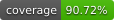

# manage-apple-notes

[](https://github.com/jdmacleod/manage-apple-notes/actions/workflows/ci.yml)
[](https://github.com/jdmacleod/manage-apple-notes/actions/workflows/ci.yml)
[](https://www.python.org/downloads/)
[](https://www.apple.com/macos/)
[](https://opensource.org/licenses/MIT)

Scripts and workflows for organizing Apple Notes using AI-powered classification into a user-defined folder taxonomy — PARA, Zettelkasten-influenced, or custom. Optional [Forever Notes](https://forevernotesframework.com) structural features (Hub notes, tags) are available in strict mode.

The pipeline is: **export → discover themes → AI classify → human review → apply**. Nothing touches your notes until you approve a proposal.

## Prerequisites

- macOS with Apple Notes
- [uv](https://docs.astral.sh/uv/) (`brew install uv` or `curl -LsSf https://astral.sh/uv/install.sh | sh`)
- An LLM provider: an [Anthropic API key](https://console.anthropic.com) (cloud) **or** [Ollama](https://ollama.com) running locally

## Setup

```bash
# 1. Clone
git clone https://github.com/jdmacleod/manage-apple-notes.git
cd manage-apple-notes

# 2. Activate pre-commit hook (blocks accidental data commits)
git config core.hooksPath .git-hooks

# 3. Copy and fill in personal config (these files are gitignored)
# Use taxonomy.example.yaml (Forever Notes / Zettelkasten) or taxonomy.para.yaml (PARA method)
cp config/taxonomy.example.yaml config/taxonomy.local.yaml
cp config/settings.example.yaml config/settings.local.yaml
# Edit both files with your actual Apple Notes folder names.
# If all your taxonomy folders live inside a single container folder in Apple Notes
# (e.g. "Library"), set toplevel_folder.enabled: true and update toplevel_folder.name
# in settings.local.yaml to match.

# 4. Install Python dependencies and create virtual environment
uv sync

# 5. Set your API key / provider URL
cp .env.example .env
# Edit .env — add ANTHROPIC_API_KEY for cloud, or set OLLAMA_BASE_URL for local
```

## Quick Reference

See [docs/runbooks/main-workflow.md](docs/runbooks/main-workflow.md) for the full walkthrough.

```bash
# Initial library setup (one-time)
uv run notes export              # export from Apple Notes
uv run notes backup              # safety backup before bulk changes → data/backups/
uv run notes discover            # map thematic clusters → data/theme-maps/
# → HUMAN: review theme map, add subfolders to taxonomy.local.yaml
uv run notes classify            # classify notes → data/proposals/
# → HUMAN: review proposal JSON
uv run notes apply --dry-run     # preview moves
uv run notes apply               # apply approved moves
uv run notes dedup               # detect duplicates → data/dedup-proposals/
# → HUMAN: review dedup proposal
uv run notes apply-dedup         # preview deletions (dry-run by default)
uv run notes apply-dedup --execute  # delete confirmed duplicates

# Ongoing
uv run notes backup              # timestamped backup to data/backups/
uv run notes inbox               # triage Inbox captures
uv run notes audit               # quality report (stale, stub, duplicate)
uv run notes sync-hubs           # update ✱ Home and ✱ Hub notes (strict mode only)

# Recovery
uv run notes restore             # recreate notes lost during apply
uv run notes repair-restored     # fix formatting after an iCloud Recently Deleted restore
```

Most commands accept `--dry-run` to preview without making changes. `apply-dedup` is a dry-run by default; pass `--execute` to apply deletions.

> **Backup scope:** `notes backup` saves a text-only snapshot — note titles, plaintext body, and folder paths. Images, attachments, sketches, and formatting are not captured. For full media backup, use Time Machine or a clone utility (CCC, SuperDuper) to back up `~/Library/Group Containers/group.com.apple.notes/`.

Full documentation lives in the [`docs/`](docs/) directory.

## Privacy

This is a public repo. Your note content and folder names never leave your machine unencrypted:

- `config/taxonomy.local.yaml` and `config/settings.local.yaml` are gitignored
- `.env` (your API keys) is gitignored; only `.env.example` is committed
- The entire `data/` directory is gitignored
- A pre-commit hook blocks accidental commits of private files

See `config/taxonomy.example.yaml` (Forever Notes / Zettelkasten), `config/taxonomy.para.yaml` (PARA method), and `config/settings.example.yaml` for the committed templates.

## License

MIT
